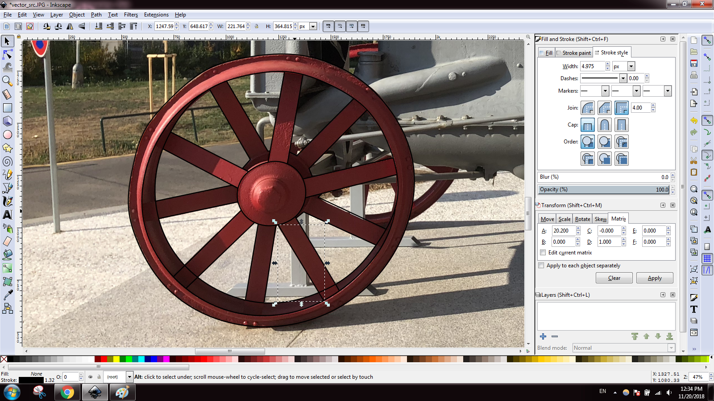
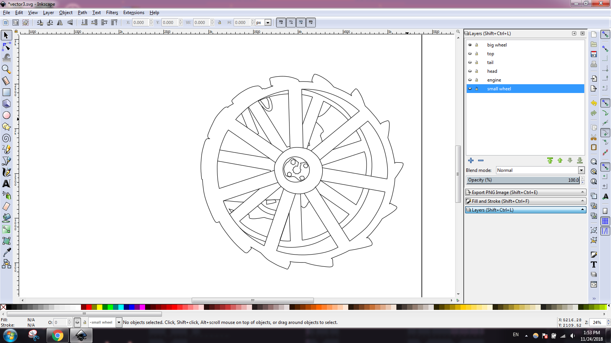
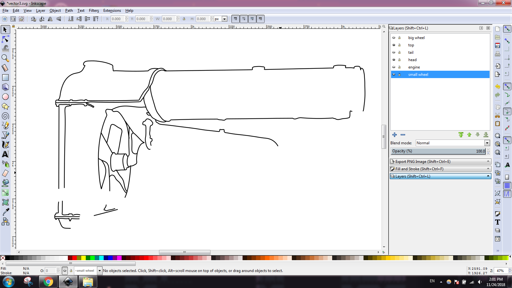
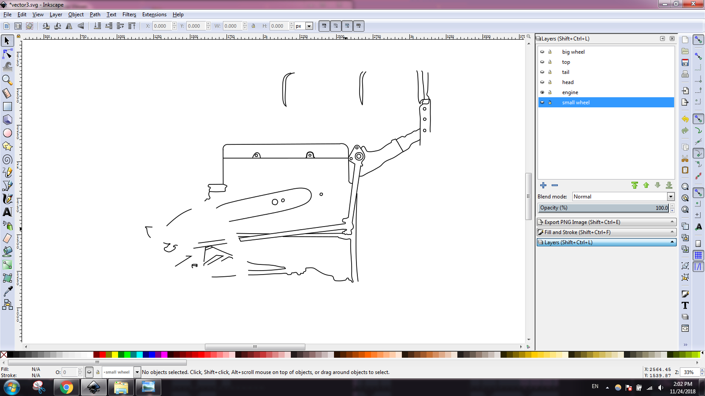
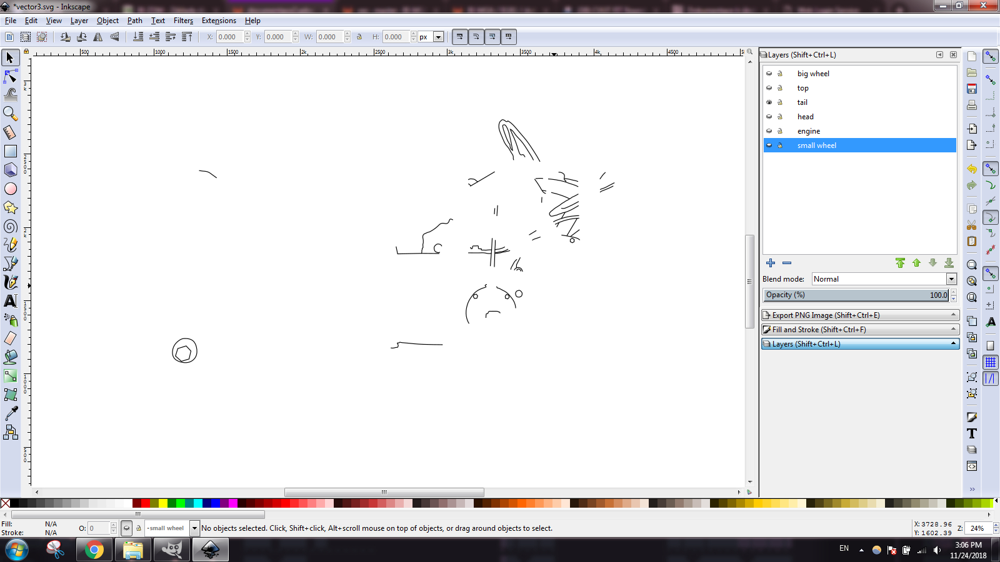
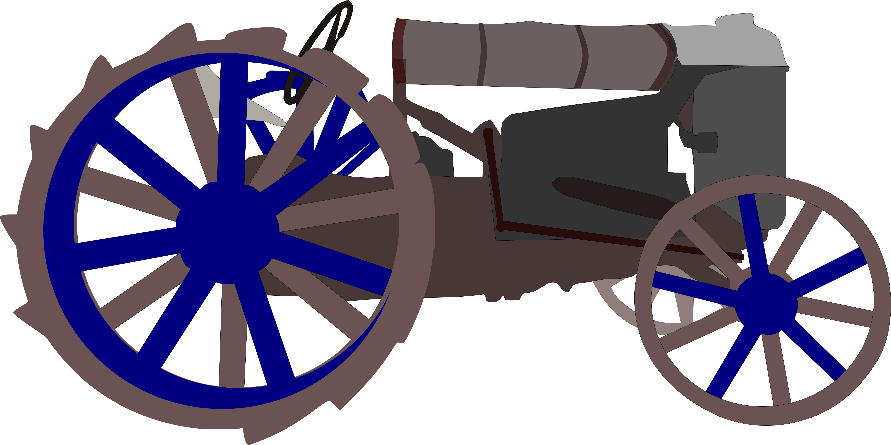
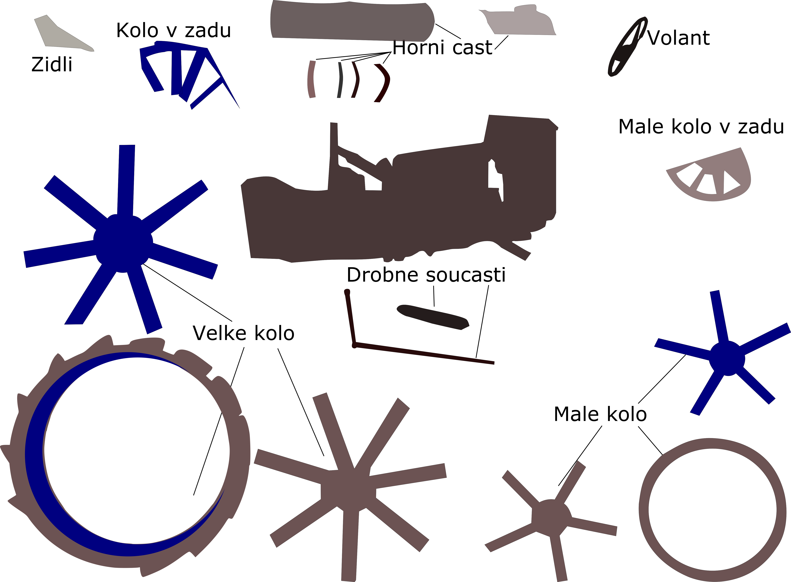

= Zdrojove obrazek:

_Note:_ Vyuzil jsem ten samy obrazek pro kazdy typ vektorizace aby to bylo nahlednejsi

image::vector_src.jpg[900,900]

*Software:* Inkscape

= Automaticka vektorizace:

== Postup

_Note:_ Vybral jsem si nastaveni ktere se mi libili nejvic a hral jsem hru asi pul hodiny.

image::vec/vector2.png[900, 900] 

== Vysledek

*Cas:* 20~30 minut

= Vektorizace obtahem

Jako první jsem si vybral obrázek. Zvolil jsem bitmapu méně náročnější na objekty. Řekl jsem si, že se pokusím více zaměřit na ojekty základních tvarů. Na začátku jsem si vložil do dokumentu obrázek. Uzamkl vrstu a pomocí nástrojů Tvorba kruhů, elips a oblouků, Tvorba obdélníků a čtverců a Tvorba hvězd a polygonů, jsem vytvořil základní tvar. Buď jsem to převedl na křivku pomocí CTRL - SHIFT - C (myslím, že je to vytvořit křivku, nebo tak) a upravil počty bodů a křivky a tvar nechal tak, nebo jsem upravil křivky a body.

 

 

 

 

== Vysledek

 

Vektorizace obtahem byl podle mě nejlepší způsob vektorizace ze 3 způsobů, které jsme dělali. Přišlo mi jako dobrý způsob, přidělávat si čáry tužkou nebo baziérové křivky podle potřeby a nemuset editovat již existující tvary. Věřím, že vektorizace překryvem se hodí na některých fotkách, kde jsou hlavně pravidelné objekty, což se o této fotce moc říct nedá.

*Cas:* 7-8 hodin

= Vektorizace překryvem

To se sklada z ...

== Postup

- Postup práce není složitý,ale spíše pracný. Využíval jsem nástroje jako obdelník a elipsa a pero, dále průhlednost a cestář (vytváření objektů pomocí logických operací). Všechny plochy jsem postupně pokryl různými jednoduchými objekty, poté za pomocí cestáře a pera jsem je tweaknul, tak aby, co nejpřesněji překrývaly plochy. Jako podklad mi sloužila zase zamknutá vrstva s fotografií podobně jako u obtahu.

*Cas:* 5-6 hodin