= Zdrojove obrazky

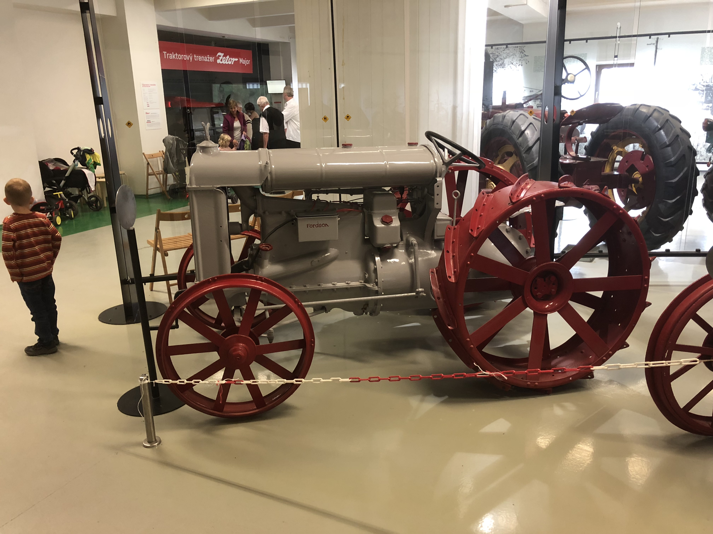 

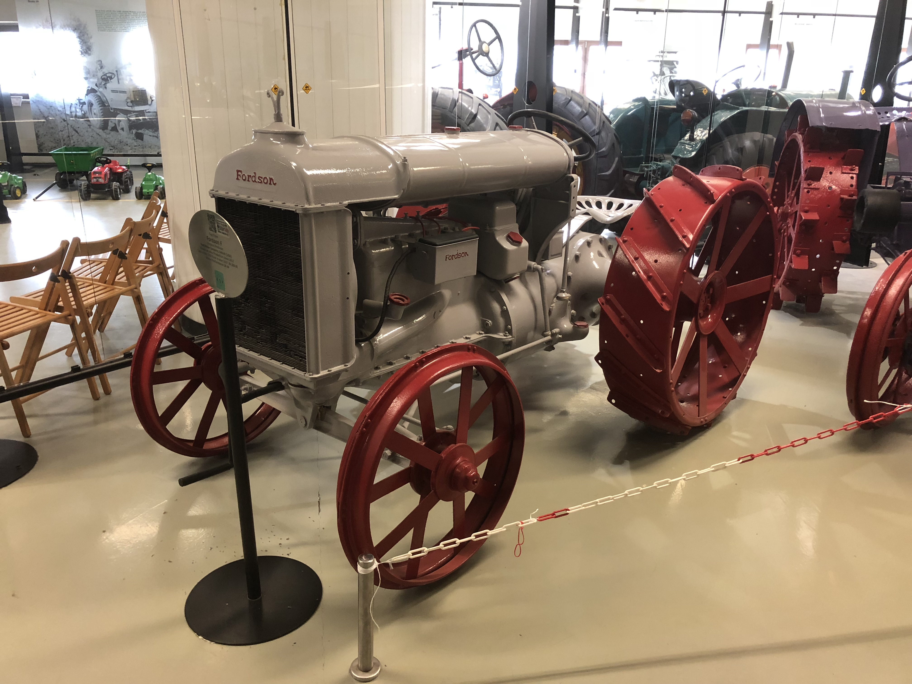

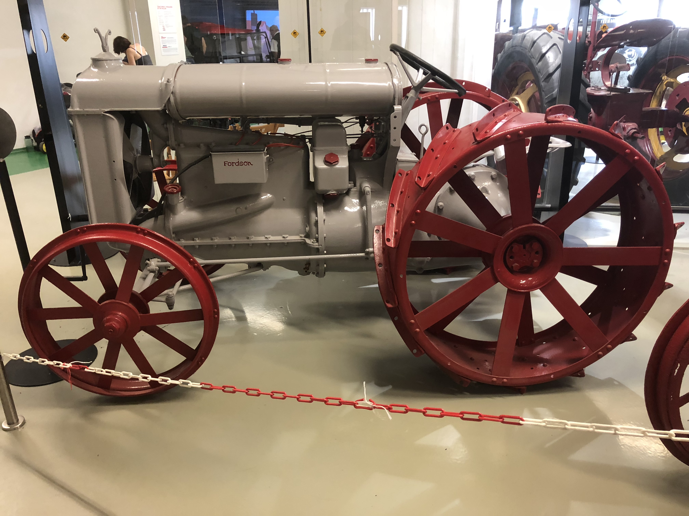

image::3d/4.JPG[900,600]

*Software:* Blender

= Postup

== Velka kola + soucasti

Velka kola se sklada s desitek kusu, proto budu to popisovat jako by se skladali s dvou.

Levy kousek se sklada z kubu + array a na zaklade kruha. Uprostred je celinder. Z opacne strany je torus ktery jsem opravil pomoci kouzla.
Docela nepochopil jak jsem to vytvoril, protoze postupni zkousil ruzne modifikace na to. (ty modifikace tam by nemneli byt(jako Deform -> Wave a tak dal))

Pravy kousek se sklada z obdelniku (ten kruh) a hrbu ( obdelnik + obdelnik ( boulevska funkce (spojeni))) + array. 

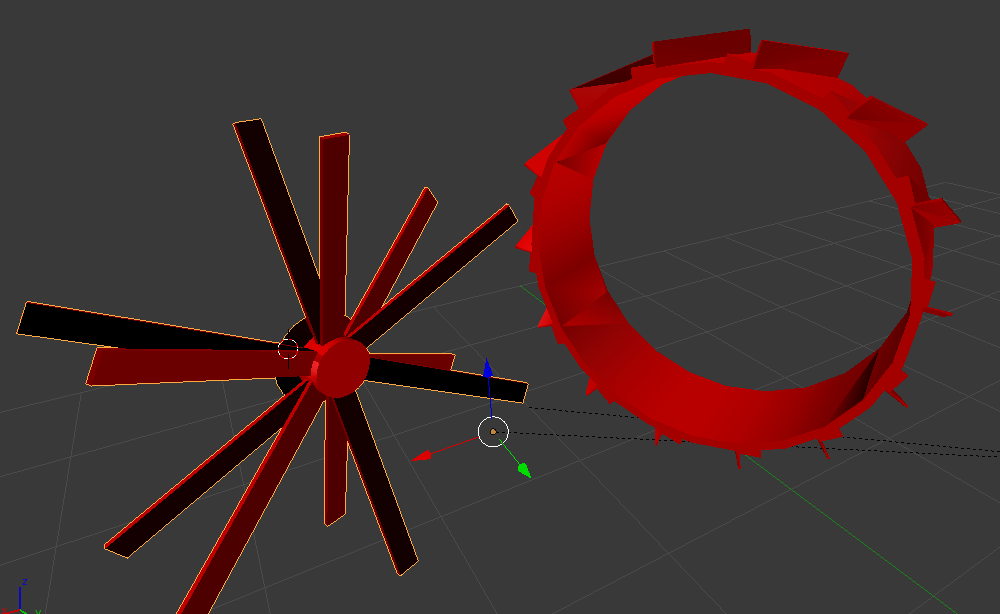

== Zadni cast

Note: na zacatku vytvoril jsem šroub pomoci obdelniku. ( abysme nemuseli se tomu venovat ( vsude budu uzivat ten samy sroub)).
Nekdy budu rikat plus a minus jako boulevska funkce sjednoceni a ruznice

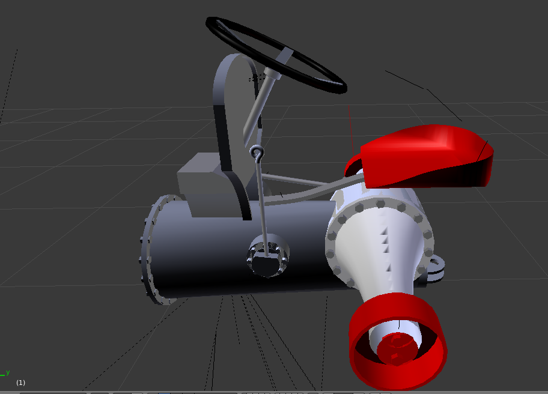

! Dal budu popisovat objekty zleva doprava

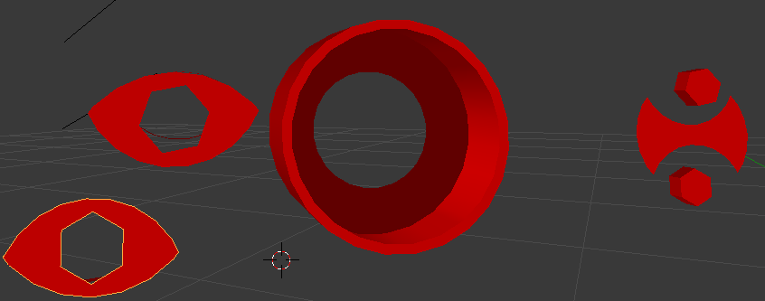

1)Prunik dvou kruhu + boulevska funkce (difference) s sroubem)

2)Cylinder boulevska funkce (difference) s trohu mensim celindrem a pak to same s este mensim cilindrem (tim to padem vytvoril jsem tu diru)

3)Kruh minus kruh (dvakrat)

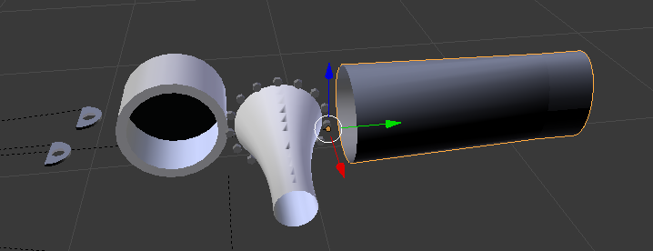

1)Pulka kruha minus srouby

2)Cylinder bez dolni casti 

3)Pridal jsem cilindru vic hran a opravil jsem podle nih

4)Cylinder bel dolni a horni hrany

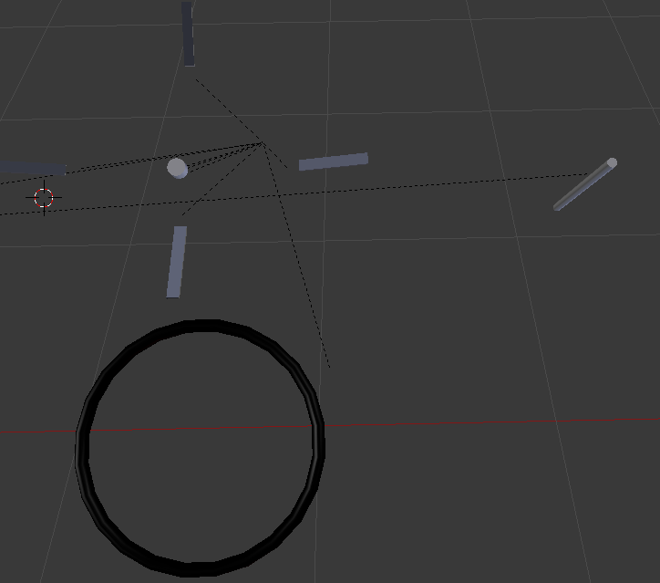

Torus + obdelniki (nula stres)

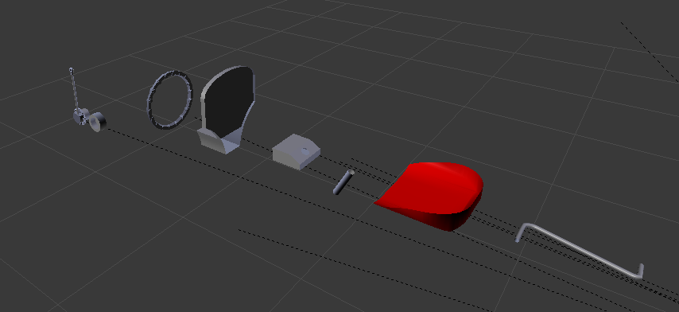

1)Cylinder + gaussova krivka (dolu jsou cylindry)

2)Zase cylinder minus cylinder

3)Pridal jsem obdelniku nekolik hran a dlouho to opravoal (neni to slozity ale zabralo hodne casu).

4)Obdelnik + par hran a manipulace s nima

5)Cylinder

6)Coub + okrouhlene hrany + boulevska funkce (differrence s necim co uz nepatuju)

7)Cylinder + gaussova krivka

== Predni kolo + soucasti

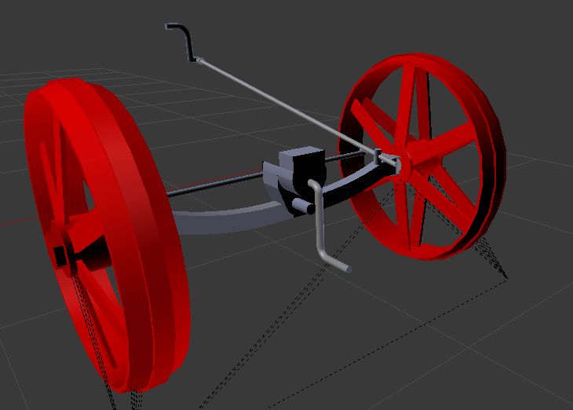

Postup zde byl docela jednoduchy

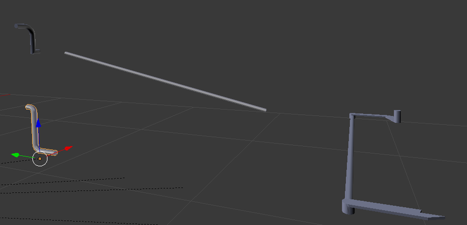

To jsou ruzna kombinace cylindru a gausovych krivek

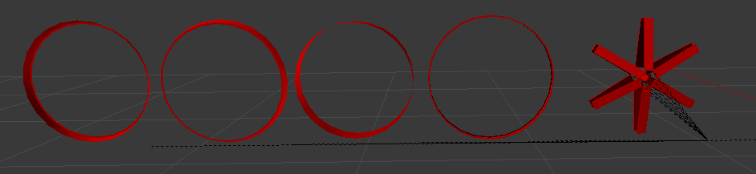

Cylinder minus mensi cylinder v ruznych variacich. Nepodarilo se mi opravit jeden objekt tak aby to bylo chezky a proto vyresil jsem to pomoci kombimaci tech cylindru.
Prvni objekt zprava je trochu jiny. Sclada se z obdelniku a cylindra mezi nima.

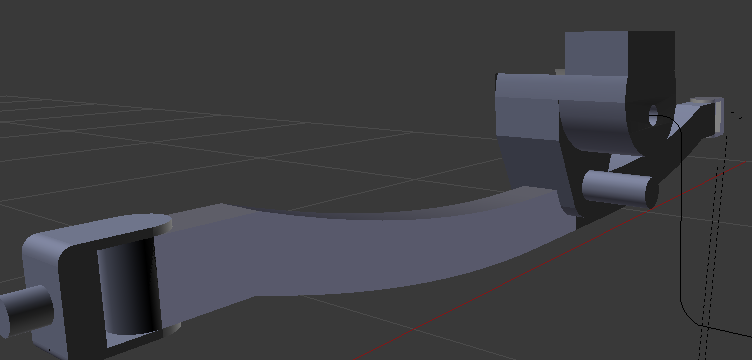

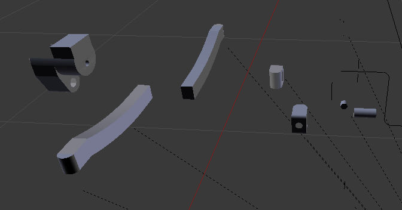

1)Cub + cylinder - mensi cylinder + cylinder kteremu jsem pridal hrany a poravil podle toho

2)Obdelnik kteremu pridal hrany a opravil. Na konce pridal cylinder.

3)Obdelnik kteremu jsem okrouhlil hrany + obdelnik zdola a zhoru a celinder mezi nima - cylinder ( to je ta dira ). Boul fun spojit.

== Motor a ostatni kousky

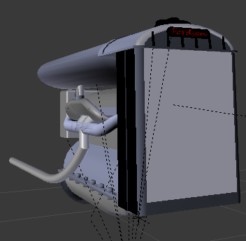

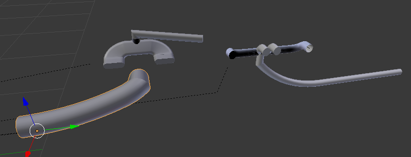

Zase cylindry + gausseva krivka a jejich variace.

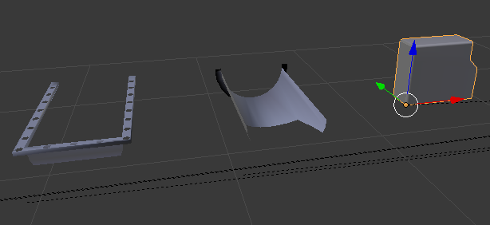

1)Obdelnik minus mensi obdelnik minus dalni cast minus srouby plus trohu opraveny obdelnik

2)Cylinder minus pulka plus vetsi cylinder na konce a minus to co tam bylo navic kdyz jsem to spojil

3)Obdelnik minus obdelnik (dvakrat) a okrouhlit

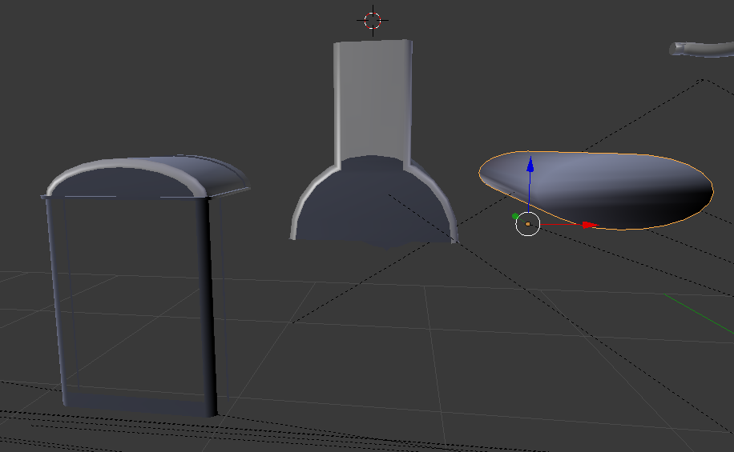

1)Okrouhleny obdelnik minus obdelnik a pak jsem roztahl horni cast a pak roztahl jsem to co jsem roztahl a zase okrouhlil

2)Cylinder minus pulka plus obdelnik a okrouhlil

3)Roztazeny okrouhleny cylinder

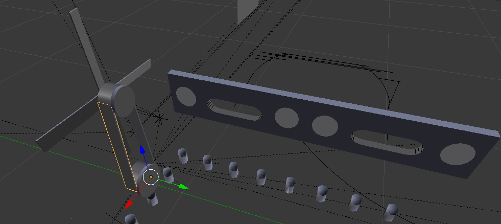

== Hotovo

Cas ~8 hodin video tutorialu a ~20 hodin prace 

= Vysledek

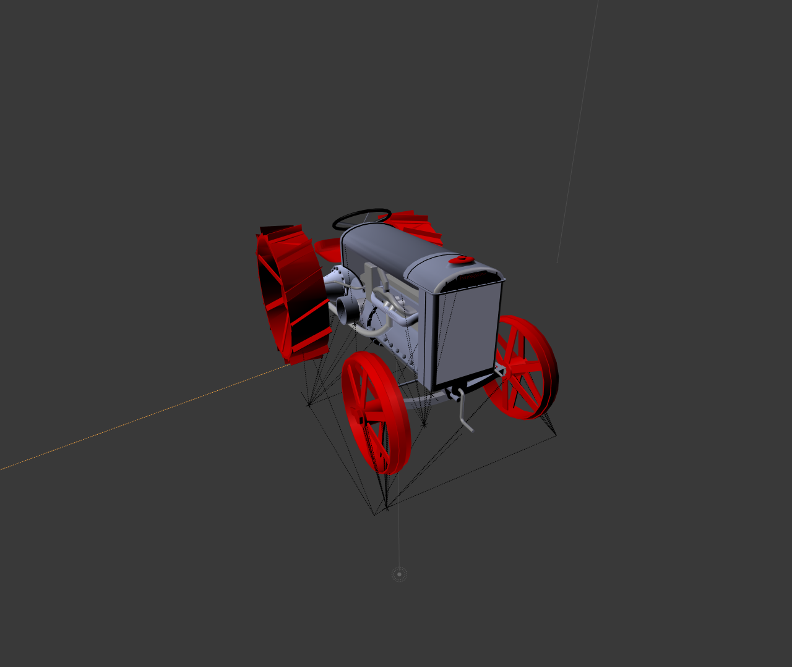

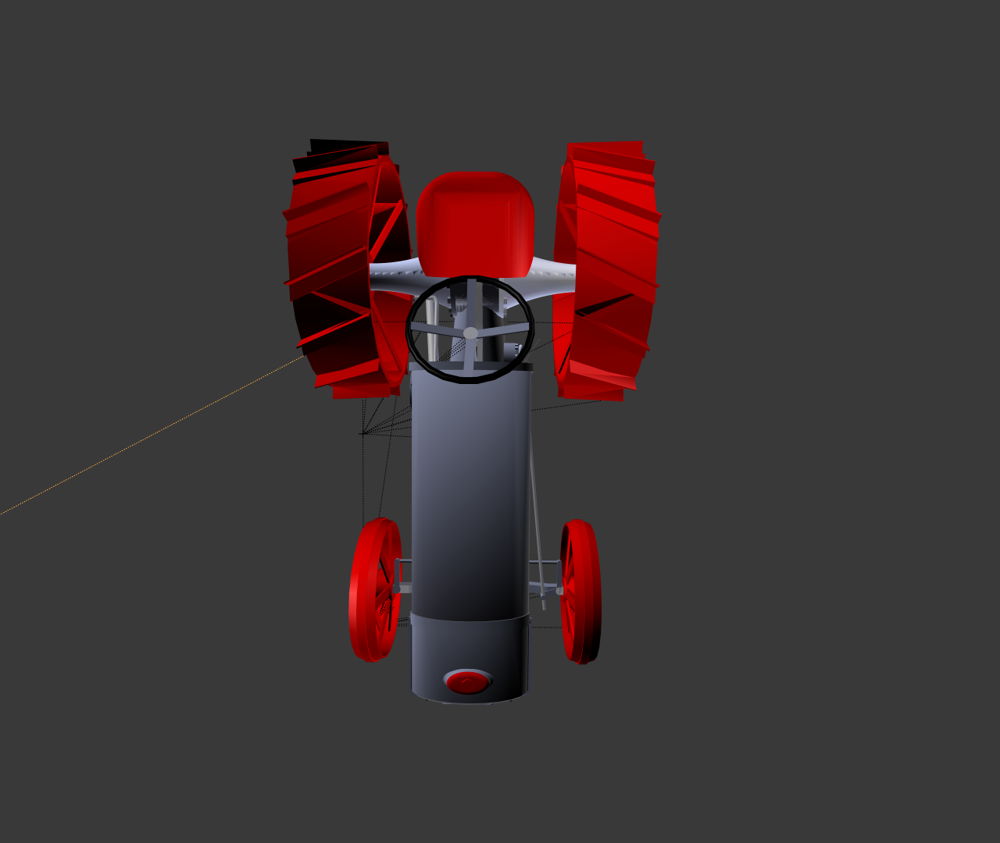

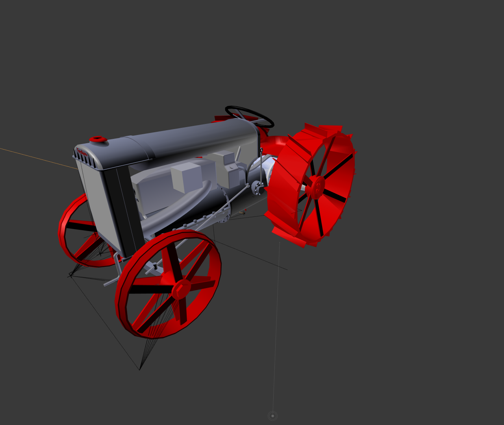

