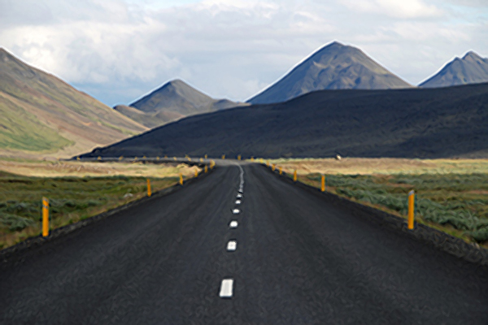

# Bitmap editor

A GIMP Python plugin for integer scaling pixel art to higher resolutions using the XBR algorithm.

xBR ("scale by rules"), created by Hyllian, works much the same way as HQx (based on pattern recognition), and would generate the same result as HQx when given the above pattern. Here you can see superXBR3 implementation.

It uses some combinations of known linear filters along with xBR edge detection rules in a non-linear way. It works in three passes and can only scale an image by two (or multiples of two by reapplying it and also has anti-ringing filter).

More about pixel art scaling can be found here link:https://en.wikipedia.org/wiki/Pixel-art_scaling_algorithms#xBR_family[Wiki]

1. Scale image (literaly)
2. Sample supporting pixels in original image 
3. Clamp to prevent ringing artifacts ( low-pass filter )
4. Sample and add weighted components
5. Clamp to prevent ringing artifacts ( low-pass filter )

## Installation

Add Scaler.py to the directory where your GIMP plugins are located:

1. Download this file

2. Open GIMP

3. Edit -> Preferences

4. In the Folders dropdown on the left, find the Plugins tab.

5. Highlight one of the directories and click the top right button

6. Drag superxBR.py into the directory, then restart GIMP. You will find the plugin in Filters >> Enhance >> Super-xBR(py).

## Using

Plugin's location :  Filters -> Enhance -> Super-xBR(py)

### !!! ATTENTION !!!

Algorythm implementention is not effective. Big resolutions may take plenty of time to be rescaled.
Available scaling factors : 2, 4, 8, etc

## Examples

Original image 

Scaled 2x

 

Another example here

Original image 

Scaled 2x

 

= Program documentation

Small foo for edge detection
----
def abs_diff(val1, val2):
----

Clamps x to a distance between pixels
----
def clamp()
----

Transforms an array of RGB or RGBA values into an array of single integer RGBA values.

Since the input is RGB, alpha is assumed to be 255.

Inputs: integer width of the picture, integer height of the picture, an RGB or RGBA pic array,

and a flag for RGBA: true if the input is RGBA, false if RGB.

Returns: an integer array containing RGBA values for each pixel, of size width * height

----
def rgba_to_int(width, height, pic_arr, rgba_flag):
----

Does the opposite of rgba_to_int - transforms the integer into an RGBA array.

See above for the format of the RGBA array.

The integer format is clearly defined, so this one is pretty easy.

----
def int_to_rgba(width, height, pic_arr):
----

Calculates diagonal edge value from pixel matrix and pixel weightings

----
def diagonal_edge(mat, wp):
----

Described in the introduction algorithm.
----
def python_superxBR(timg, tdrawable, scale_factor = 2):

...
 # - - - - - Super-xBR Scaling - - - - -
    # First pass begins here
    # Pixel weightings for pass 1.
    gimp.progress_init("Running first pass of Super-xBR on " + tdrawable.name + "...")

    ...
    
        # sample supporting pixels on original image: sx and sy
        for y in range(0, out_height, 2):
            for x in range(0, out_width, 2):
            
            ...
            
            # clamp pixel locations
            # sample and add weighted components
            # clamp to prevent ringing artifacts
            
            
    # Second pass ( comolitely similar )
    gimp.progress_init("Running second pass of Super-xBR on " + tdrawable.name + "...")
    
    ...
    
    # Third pass ( ablosutely comlitely similar )
    gimp.progress_init("Running third pass of Super-xBR on " + tdrawable.name + "...")
    
----

Info about plugin

----
register()
----

== Source

link:Src/Scaler.py[Source code]