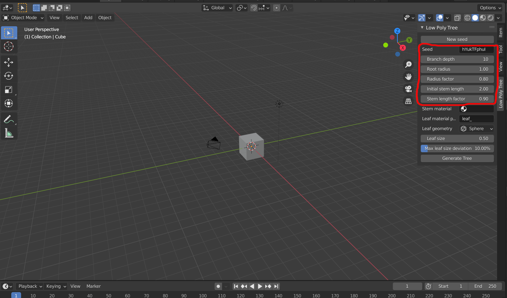

= 3D editor

A Blender add-on that allows to create low-polly random trees, based on the built-in "Sapling" tree generator.

== Installation

 Supported with 2.8* version. For 2.9+ you may use 2.83 LTS script. More about LTS can be found here https://www.blender.org/download/releases/2-83/

Latest version allows you to install it as add-on using zip file.

Edit -> preferences -> Add-ons -> install.

Then select downloaded zip file.

Otherwise you may use is as script with matchable link to the libreries.

== Using

Plugin's location :  Layout -> Tools shelf -> Low polly tree. 

For manipulating with result object was created additional ui. 

It containt several options to make generation more varied. 

UI is simple and intuitive. Any discribtion of it is not required.

== Configurations

"New seed" button allow you to create another different tree with the same configurations.

"Branch depth" button is responseble for the lenght (depth and also amount) of the tree and branches (including of leafs).

"Root radius" button is responsible for the distribution of branches.

"Initial stem lenght" is responsible for the size of tree (may create different combinations with "Branch depth").

"Stem length factor" is responsible for the thickness of branches and leafs.

2 following buttons serve to apply matterial to leafs and stems.

== Examples

== Program documentation

= util.py

util.py is an additional library created by me to solve object's 'physic'.

Return the angle based on the steps
----
def angle_func():
----

Scale the entire object
----
def scale_func():
----

Solve position and agle of branch
----
def branch_prop_func():
----

Main foo that solve location and agle of objects according to the space between branches and leafs
----
def extrude()
----

Solve position of leafs according to the branches they are located at
----
def add_leaves()
----

= \__init__.py

init is main script that is responsible for ui and calling of generation foos from util.

It is main class that can be corrected with ui by calling the util foos. According to selected variables creates the result tree.
----
class PerformGeneration(bpy.types.Operator):
----

It is UI.
----
class VIEW3D_PT_low_poly_tree(Panel)
----

Register plugin
----
def register():
----

Register unplugin
----
def unregister():
----

== Source

link:Src/generator.zip[source.zip]
