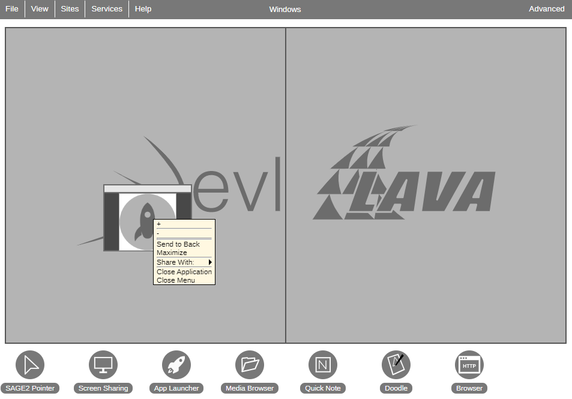

=== Kontextové menu na pravé tlačítko myši

Jako příklad použiti contextového menu veymeme jednoduchou textovou kalkulačku. Vytvoříme složku `context_calculator` a uvnítř soubory `context_calculator.js` a `instructions.json`

==== instructions.json
 
[source,json]
 {
   "main_script": "context_calculator.js",
   "width": 300,
   "height": 200,
   "animation": true,
   "title": "Context Calculator"
 }
 
==== context_calculator.js

[source,javascript]
 var context_calculator = SAGE2_App.extend({
    init: function (data) {},
    draw: function (date) {},
    getContextEntries: function () {},
    saveNums: function (responseObject) {},
    setOperation: function (responseObject) {},
    clearAll: function () {}
 });

Na začátku si podíváme na funkce `init(data)`.

[source,javascript]
    init: function (data) {
        // Vytváříme "div" HTML uzel
        this.SAGE2Init("div", data);
        // Nastavuje jeho id
        this.element.id = "calkulator example";
        // Obarvíme pozadi
        this.element.style.background = "white";
        // Voláme funkce, která inicializuje základní parametry
        this.clearAll();
    },
    
Jako obvykle ve funkci `` `init(data)` inicialiyujeme okno aplikaci a proměny. Tentokrát ale spustíme okno v modu `"div"`, což je variaci tegů `div` v HTML. 
Tohle nam dovolí psát HTML-kod a zobrázovat ho na obrazovce. Psát ten kod musíme do parametru `this.element.innerHTML`. Dělat to budé funkce `draw(date)`.

[source,javascript]
    draw: function (date) {
        // Zapisuje do kontejneru "div" kontent pomoci parametru "this.element.innerHTML" v závislosti na parametru "this.status"
        if (this.status == "numbers")
            this.element.innerHTML = "Enter two numbers.";
        else if (this.status == "operation")
            this.element.innerHTML = this.number_1 + " | " + this.number_2 + " Select operation.";
        else if (this.status == "result")
            this.element.innerHTML = this.number_1 + " | " + this.number_2 + " " + this.operator + " " + this.result;
    },
    
Tato funkce zobrazuje text v závislosti na stavu programu, který uložen v paramertu `this.status`. Stav můžeme měnit pomoci kontextového menu. 
Standartní kontextové menu obsahuje v sobě taková tlačátka, jako "Uzavřit contextové menu", "Uzavřit aplikace" apod.

Abychom mohli přidat svoe vstupy do contextového menu musíme implementovat `getContextEntries()`. Tato funkce musí vracet seznam vstupů. Všechny vstupy se do seynamu zapísují ve tvaru JSON. Standartní tlačítko musí obsahovat tři základní parametry: `description`, `callback`, `parameters`.

[source,javascript]
 var entries = [];
 entries.push({
    description: "-",
    callback: "setOperation",
    parameters: {
       operator: "-"
    }
 });

Do parametru `description` ukládame popis, který se zobrazí na obrazovce. Do `callback` ukládame název funkce, kterou budeme volat a do `parameters` - všechny parametry, které pošleme do funkci `callback`.

[source,javascript]
 setOperation: function (responseObject) {
    // V yávislosti na parametru "responseObject.operator" zavolá určitou operaci a uloží vysledek
    if (responseObject.operator == "+") {
        this.result = this.number_1 + this.number_2;
        this.operator = "+";
    }
    else if (responseObject.operator == "-") {
        this.result = this.number_1 - this.number_2;
        this.operator = "-";
    }
    else if (responseObject.operator == "x") {
        this.result = this.number_1 * this.number_2;
        this.operator = "x";
    }
    else if (responseObject.operator == "/") {
        this.result = this.number_1 / this.number_2;
        this.operator = "/";
    }
    this.status = "result";
    this.getFullContextMenuAndUpdate();
 },

Pokud do callbacku se neposílají žadné parametry, můžeme nepsát nic v závorkach.

[source,javascript]
 entries.push({
     description: "Clear",
     entryColor: "lightred",
     callback: "clearAll",
     parameters: {}
 });
 
[source,javascript]
 clearAll: function () {
     // Nastaví všechny parametry do počatečného stavu
     this.status = "numbers";
     this.number_1 = 0;
     this.number_2 = 0;
     this.result = 0;
     this.operator = "";
     this.getFullContextMenuAndUpdate();
 }

Pokud chcete udělat vstupní textové pole musíte k parametrům tlačítka přidat `inputField` a `inputFieldSize`

[source,javascript]
 entries.push({
     description: "Number1 Number2",
     callback: "saveNums",
     parameters: {},
     inputField: true,
     inputFieldSize: 20
 });

`inputField: true` znamená, že chceme udělat z toho vstupní textové pole a v `inputFieldSize` ukládáme počet symbolů, které můžeme do tohoto pole zapsát. Zappsáný text můžeme dostat v callback v parammetru `responseObject.clientInput`.

[source,javascript]
 saveNums: function (responseObject) {
     // Callback funkce. Pokud uživatel napišé dvá čisla, funkce uloží je a přepné stav.
     // Uživatelský vstup lze nalezt uvnitř parametru "responseObgect.clientInput". 
     var numArray = responseObject.clientInput.split(" ");
     if (numArray.length == 2 && Number(numArray[0]) != NaN && Number(numArray[1]) != NaN) {
         this.number_1 = Number(numArray[0]);
         this.number_2 = Number(numArray[1]);
         this.status = "operation";
         // Po volání funkce aktualizuje contextové menu(znovu zavolá "getContextEntries()")
         this.getFullContextMenuAndUpdate();
     }
 },
    
Pokud byste chtěli rozdělit vstupy můžete pro to použit separator. Pro to ptřebujete přidat ho do seznamu vystupů.

[source,javascript]
 entries.push({
       description: "+",
       callback: "setOperation",
       parameters: {
          operator: "+"
    }
 });
 // Přidame separator do contextového menu
 entries.push(separator);
 entries.push({
    description: "-",
    callback: "setOperation",
    parameters: {
       operator: "-"
    }
 });

Program volá `getContextEntries` jednou a vytváří kontextové menu. Pokud ale budeme chtit změnit kontextové menu, musíme použit funkce `this.getFullContextMenuAndUpdate()`, která spustí `getContextEntries` a tím znovu vygeneruje contextové menu.

[%hardbreaks]
=== Zdrojový kod:

link:https://gitlab.fit.cvut.cz/BI-PGA/b201/dubinden/blob/master/SAGE/context_calculator/context_calculator.js[context_calculator]
