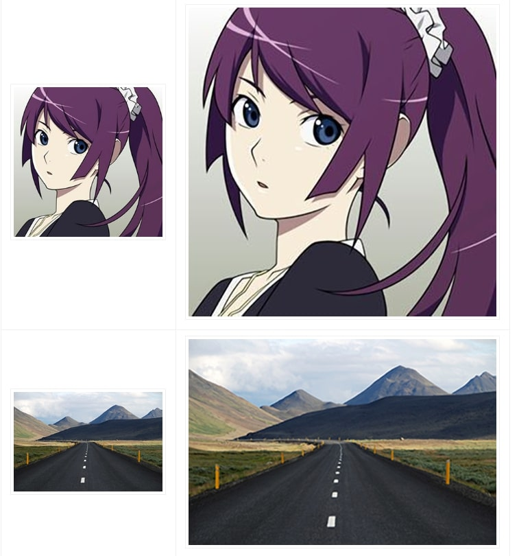
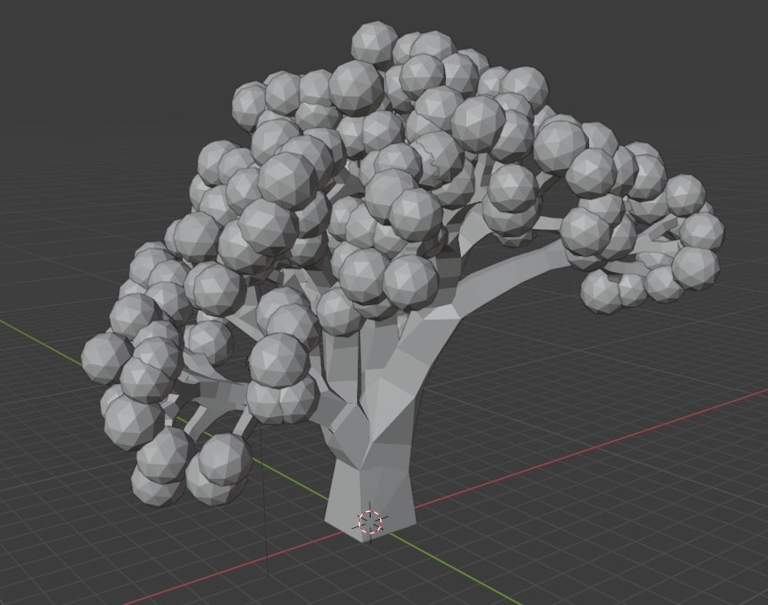
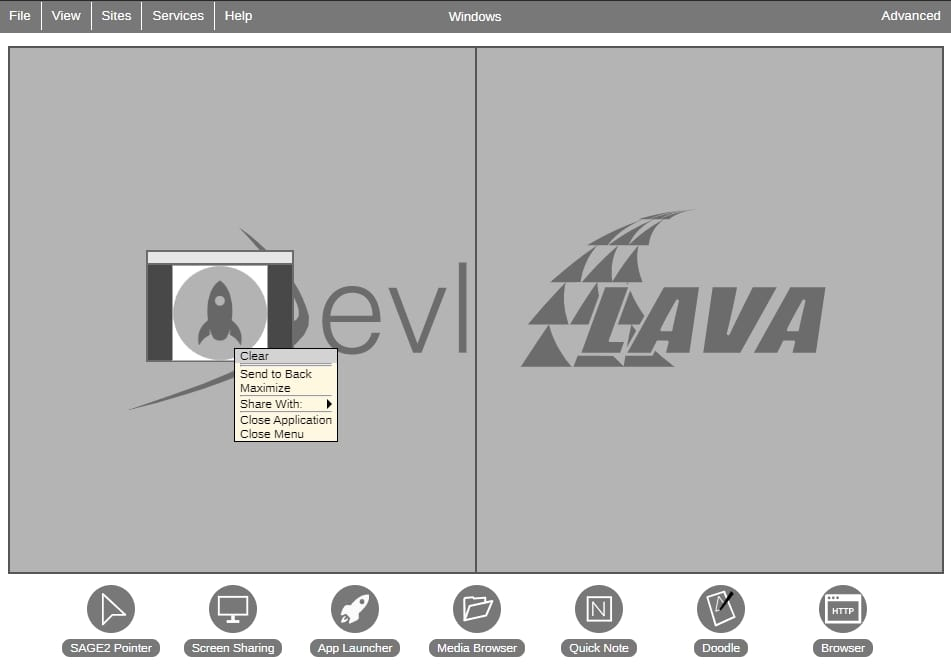

# 2D editor

A GIMP Python plugin for integer scaling pixel art to higher resolutions using the following scaling algorithm.

** xref:/2D/dokumentace1.adoc#[Documentation]

[,700,1600,align="center"]

# 3D editor

A Blender add-on that allows to create low-polly random trees, based on the built-in "Sapling" tree generator.

** xref:/3D/dokumentace2.adoc#[Documentation]

[,875,750,align="center"]

# SAGE2

Context menu and all the content of it.

** xref:/SAGE/dokumentace3.adoc#[Documentation]

[,875,750,align="center"]